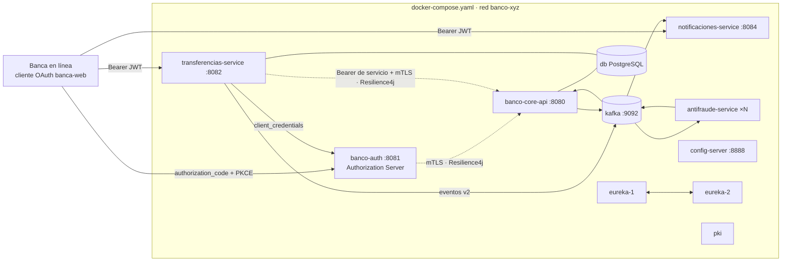

# Banco XYZ — Microservicios y resiliencia en la nube con Spring Cloud, OAuth 2.0 y Docker

Octava etapa de la modernización del **Banco XYZ**. El ecosistema de las semanas 6 y 7 (Config Server, Eureka,
Resilience4j y la saga de transferencias sobre Kafka) queda listo para un entorno cloud:

- **OAuth 2.0.** banco-auth es ahora un servidor de autorización estándar (**Spring Authorization Server**): los
  usuarios entran con **authorization_code + PKCE** y los servicios entre sí con **client_credentials**. Cada servicio es
  un servidor de recursos que exige un *scope* por operación.
- **Docker.** Cada microservicio tiene su **Dockerfile multi-etapa** (compila con Maven, corre en un JRE 21 sin
  privilegios y con *healthcheck*).
- **docker-compose.yaml.** Un solo archivo levanta los **once contenedores** en orden por salud, en una red propia, con
  volúmenes, límites de memoria y reinicio automático: `docker compose up -d --build`.
- **Resilience4j por entorno** y **eventos versionados**, que eran las dos observaciones de la semana 7.

Por indicación del profesor (observación 5 de la semana 6) la entrega se concentra en lo solicitado: **no incluye BFF
ni batch**.

| Proyecto | Qué es | Imagen · servicio del compose | README |
|---|---|---|---|
| [`banco-xyz-cloud/`](banco-xyz-cloud/) | Plano de control: Config Server (HTTPS + mTLS + Basic) con `configuracion/`, Eureka, imágenes de la PKI y de la base, scripts y evidencias | `config-server` :8888 · `eureka-1` :8761 · `eureka-2` :8762 · `pki` · `db` | [ver](banco-xyz-cloud/README.md) |
| [`banco-core-api/`](banco-core-api/) | Dueño del dinero; servidor de recursos OAuth; en la saga reserva, acredita y compensa | `banco-core-api` :8080 (interno) | [ver](banco-core-api/README.md) |
| [`banco-auth/`](banco-auth/) | **Servidor de autorización OAuth 2.0 / OpenID Connect**; claves RSA que rotan | `banco-auth` :8081 | [ver](banco-auth/README.md) |
| [`transferencias-service/`](transferencias-service/) | API de transferencias (servidor de recursos) y cliente OAuth del core; inicia la saga | `transferencias-service` :8082 | [ver](transferencias-service/README.md) |
| [`antifraude-service/`](antifraude-service/) | Decide cada reserva; escala con `--scale` | `antifraude-service` (1..3 contenedores) | [ver](antifraude-service/README.md) |
| [`notificaciones-service/`](notificaciones-service/) | Avisa al cliente el resultado (servidor de recursos) | `notificaciones-service` :8084 | [ver](notificaciones-service/README.md) |

Cada carpeta es un proyecto independiente (su `pom.xml`, sus pruebas, su `Dockerfile`); se publican juntas para
compartirlas con un enlace y se orquestan con el [`docker-compose.yaml`](docker-compose.yaml) de la raíz. No hay pom raíz
ni código compartido.

> Actividad sumativa individual — *Desarrollando microservicios y resiliencia en la nube con Spring Cloud*
> Experiencia 3, Semana 8 · **Desarrollo Backend III (PBY2203)** · Duoc UC · **Diego Carvajal**
> Repositorio: <https://github.com/dcarvajal99/banco_xyz_backend_iii_s8>

---

## 0. Resultado de la Semana 8

| Criterio de la pauta | Cómo se cumple | Evidencia en ejecución |
|---|---|---|
| 1. OAuth 2.0 con flujo funcional que protege datos y servicios | Spring Authorization Server: authorization_code + PKCE obligatorio, refresh token rotativo, client_credentials entre servicios, OIDC; scopes por operación en cada servidor de recursos; firma RS256 con JWK Set y rotación protegida por su propio scope; actuator de solo lectura | `oauth2_flujos.sh` · `proteccion_servicios.sh` · `claves_jwt.sh` |
| 2. Imágenes Docker funcionales para todos los microservicios | Un Dockerfile multi-etapa por servicio (Maven → JRE 21 alpine), capas de Spring Boot, usuario sin privilegios, *healthcheck*; imágenes propias para la PKI y la base | `imagenes_docker.sh` |
| 3. docker-compose.yaml que orquesta todos los componentes | 11 contenedores, `depends_on` por salud, red `banco-xyz`, volúmenes con nombre, puertos solo en 127.0.0.1, límites de memoria, `restart: unless-stopped`, secretos por `.env` | `ecosistema_compose.sh` |
| 4. Tolerancia a fallos con Resilience4j | `@Bulkhead` + `@CircuitBreaker` + `@Retry` con fallback en las llamadas HTTP al core; decoradores en la publicación a Kafka; **políticas compartidas en el Config Server, por entorno** | `resiliencia_core.sh` · `resiliencia_kafka.sh` · `politicas_por_entorno.sh` |
| 5. Mensajería asíncrona con Kafka | Saga coreografiada con outbox e idempotencia; **sobre de evento versionado** (v2) con migración de consumidores; DLT; escala con `--scale` | `topicos_kafka.sh` · `saga_transferencias.sh` · `eventos_versionados.sh` · `escalabilidad.sh` |
| 6. Código, documentación y evidencia | Este repositorio, un README por proyecto y un script de evidencia por criterio | §6 y §7 |

<!-- RESULTADOS -->
Pruebas automatizadas: **159, 0 fallas** en los seis proyectos (§7). Evidencias de ejecución: **15 scripts con 223 verificaciones y 0 fallas** (§6), capturadas desde un estado limpio (`docker compose down -v`: base, Kafka y PKI nuevas). El ecosistema completo queda sano en 80 s; 48 transferencias tardan 10,66 s con un contenedor de antifraude y 4,63 s con tres (2,3×).
<!-- /RESULTADOS -->

### 0.1 Respuesta a la retroalimentación

| Semana | Observación | Qué se hizo | Dónde se ve |
|---|---|---|---|
| 7 | Centralizar las políticas de Resilience4j por entorno mediante configuración compartida | Los jars ya no traen política. El Config Server define dos políticas compartidas (`http-interno`, `publicacion-kafka`) en `application.properties`; cada servicio solo dice qué política usa cada punto (`base-config`) y qué excepciones de negocio ignora; `application-nube.properties` ajusta los valores para los contenedores | `politicas_por_entorno.sh`; [configuracion/](banco-xyz-cloud/configuracion/) |
| 7 | Versionar explícitamente los eventos y planificar migraciones seguras de consumidores | Campo `version` en el sobre (v2 agrega `moneda`); cada consumidor lee con un `LectorDeEventos` que eleva v1 a v2, ignora campos desconocidos y manda a la DLT una versión más nueva que la que entiende; se despliegan primero los consumidores | `eventos_versionados.sh`; §2.5 |
| 6 | Config Server con TLS y autenticación | HTTPS, certificado de cliente obligatorio y Basic; con *fail-fast* un servicio rechazado no arranca (el contenedor termina con error) | `config_segura.sh` |
| 6 | Peers y replicación de Eureka | `eureka-1` ⇄ `eureka-2` en el compose; los clientes conocen ambos | `eureka_peers.sh` |
| 6 | Resilience4j con anotaciones o decoradores en llamadas HTTP | Anotaciones en `ClienteCore` de banco-auth y transferencias-service (ahora también `@Bulkhead`); decoradores en el outbox | `resiliencia_core.sh` |
| 6 | Rotación de claves o JWK Set | El servidor de autorización firma con las claves rotables y publica `/oauth2/jwks` | `claves_jwt.sh` |
| 6 | Concentrarse en los objetivos | Sin BFF ni batch; el resultado de la migración viaja como volcado SQL dentro de la imagen `db` | — |

### 0.2 Lo que corrigió la verificación en contenedores

Las pruebas unitarias pasaban, pero correr el ecosistema completo en Docker, y una revisión del proyecto, encontraron
defectos que se corrigieron antes de capturar la evidencia:

| Hallazgo | Consecuencia | Corrección |
|---|---|---|
| `/actuator/**` sin autenticación en banco-auth y transferencias-service, con el puerto de operación abierto a la red interna | Cualquier contenedor de la red podía rotar o retirar las claves de firma, o forzar el estado de un circuito (`POST /actuator/circuitbreakers/{nombre}` de Resilience4j) | Cliente OAuth `operacion-banco` con el scope `claves.administrar` para `/actuator/claves`; el resto del actuator es de solo lectura en todos los servicios (`OperacionProtegidaTest`, `CircuitoDelCoreTest`) |
| La imagen `apache/kafka` guarda los datos en `/tmp`, no en el volumen montado | Recrear el contenedor del broker borraba los tópicos; los servicios no los vuelven a crear hasta reiniciarse | `KAFKA_LOG_DIRS=/var/lib/kafka/data`: los datos viven en el volumen `kafka` |
| Las herramientas de consola de Kafka corrían dentro del contenedor del broker y heredaban su heap de 384 MB | Cuatro lecturas en paralelo superaban el límite de 768 MB y el OOM killer mataba al broker (Docker lo reiniciaba) | Los scripts usan un contenedor efímero propio en la red del compose; el *healthcheck* corre con un heap de 64 MB |
| El cliente con que cada nodo de Eureka se registra en su peer usaba Jersey | Si su registro expiraba (por ejemplo, tras suspender el equipo), el peer respondía 404 con el JSON de error de Spring Boot, el cliente fallaba al leerlo (400) y el nodo no se volvía a registrar: el panel lo mostraba como réplica no disponible | `eureka.client.jersey.enabled=false` y `restclient.enabled=true`: decide por el código 404 y se registra de nuevo |

## 1. Objetivo

Llevar el ecosistema de microservicios del banco a un despliegue en contenedores, reproducible con un solo comando,
protegido con OAuth 2.0 de punta a punta (usuarios y servicios), tolerante a la caída de sus dependencias y con
mensajería que pueda evolucionar sin romper a los consumidores.

## 2. Propuesta técnica

### 2.1 OAuth 2.0 con Spring Authorization Server

Hasta la semana 7, banco-auth recibía usuario y clave en un endpoint propio y devolvía un JWT. Eso obliga a cada
aplicación a manejar la clave del usuario. Ahora banco-auth es un **servidor de autorización** estándar:

| Cliente registrado | Tipo | Flujo | Scopes |
|---|---|---|---|
| `banca-web` | Confidencial (`client_secret_basic`) | `authorization_code` con **PKCE obligatorio** (S256) + `refresh_token` rotativo | `openid`, `profile`, `transferencias.escribir`, `transferencias.leer`, `notificaciones.leer` |
| `transferencias-service` | Confidencial | `client_credentials` | `core.cuentas.leer` |
| `operacion-banco` | Confidencial | `client_credentials` | `claves.administrar` |

- **El usuario escribe su clave solo en banco-auth** (`/login`), que la verifica contra el core con el canal
  AUTENTICACION (mTLS + clave de canal, con `@Bulkhead` + `@CircuitBreaker` + `@Retry`). El login distingue
  credenciales inválidas, usuario bloqueado, no habilitado y servicio no disponible.
- **Tokens:** access token JWT RS256 de 5 min con `kid`, `aud=banco-xyz`, `scope` y los ids del usuario en el core
  (`usuario_id`, `cliente_id`, `rol`); refresh token de 60 min que **rota** (el usado queda inválido); id token OIDC.
- **Claves:** el `JWKSource` del servidor de autorización es el almacén de claves rotables de las semanas 6 y 7:
  `POST /actuator/claves` rota (la anterior queda en gracia y sigue publicada en `/oauth2/jwks`) y
  `DELETE /actuator/claves/{kid}` la retira. Ambas exigen un token del cliente `operacion-banco` con el scope
  `claves.administrar`.
- **Puertos de operación:** en contenedores escuchan en la red interna, así que estar en ellos no da permisos. El
  actuator es de solo lectura en todos los servicios (salud, circuitos, métricas): cualquier otro método se rechaza,
  incluido el `POST /actuator/circuitbreakers/{nombre}` de Resilience4j que forzaría el estado de un circuito.
- **Servidores de recursos:** validan firma (contra el JWK Set), emisor, audiencia y vencimiento, y exigen un scope:

| Servicio | Operación | Scope exigido |
|---|---|---|
| transferencias-service | `POST /api/v1/transferencias` | `transferencias.escribir` |
| transferencias-service | `GET /api/v1/transferencias/{id}` | `transferencias.leer` |
| notificaciones-service | `GET /api/v1/notificaciones` | `notificaciones.leer` |
| banco-core-api | Canal TRANSFERENCIAS (`GET /cuentas/{id}`) | `core.cuentas.leer` **y** certificado de cliente cuyo CN es el `sub` del token |

  Además, transferencias y notificaciones solo devuelven datos del cliente del token. En el core, el token de servicio
  reemplaza la clave Basic que usaba el canal TRANSFERENCIAS en la semana 7.
- **Del lado del cliente:** transferencias-service obtiene y renueva su token con `spring-boot-starter-oauth2-client`
  (`OAuth2ClientHttpRequestInterceptor` en su `RestClient`); si no consigue token, el fallback de Resilience4j acepta la
  transferencia con validación DIFERIDA.

### 2.2 Imágenes Docker

Todas las imágenes de servicios Java siguen el mismo patrón ([ejemplo](transferencias-service/Dockerfile)):

1. **Etapa de compilación** (`maven:3.9-eclipse-temurin-21`): copia primero el `pom.xml` y descarga dependencias (capa
   que no se repite si solo cambia el código), luego compila con `-DskipTests` (las pruebas corren con `./mvnw verify`).
2. **Extracción en capas** (`java -Djarmode=tools -jar app.jar extract --layers --launcher`): dependencias, cargador,
   *snapshots* y aplicación quedan en capas separadas; un cambio de código solo cambia la última.
3. **Etapa final** (`eclipse-temurin:21-jre-alpine`): usuario `banco` (uid 10001), `HEALTHCHECK` contra el actuator de
   operación, JVM con `MaxRAMPercentage=60` y `ExitOnOutOfMemoryError`, y el perfil `tls,nube` por defecto.

Imágenes de apoyo: `banco-xyz/pki` genera la CA y los certificados en un volumen (solo si faltan) y termina;
`banco-xyz/db` es PostgreSQL 17 con el volcado de la migración en `docker-entrypoint-initdb.d`. Así nada depende de
carpetas del equipo montadas en los contenedores.

### 2.3 Orquestación con docker-compose

```
pki (termina) ─┐
db ────────────┼──► config-server ──► eureka-1 ⇄ eureka-2 ──► banco-core-api ──► banco-auth ──► transferencias-service
kafka ─────────┘                                         └──► antifraude-service (×N) · notificaciones-service
```

- `depends_on` con `service_healthy` / `service_completed_successfully`: cada contenedor arranca cuando sus
  dependencias están **sanas**, no solo iniciadas.
- Red `banco-xyz`: los servicios se encuentran por nombre (`https://banco-core-api:8080`, `kafka:9092`). Solo se
  publican las API de clientes (8081, 8082, 8084), la operación (8761/8762, 8888, 9080–9084) y siempre en
  **127.0.0.1**; el core, la base y Kafka no se exponen.
- Volúmenes con nombre `certificados`, `datos` y `kafka`; `mem_limit` por contenedor; `restart: unless-stopped`.
- Secretos por variable de entorno o archivo `.env` ([`.env.ejemplo`](.env.ejemplo)); el Config Server no reparte
  secretos.
- Los servicios arrancan con el perfil **`nube`**: el Config Server les entrega las direcciones de la red del compose
  y la política de Resilience4j de ese entorno.

### 2.4 Resilience4j centralizado por entorno

| Punto de falla | Mecanismo | Política (configuración compartida) | Ante la falla |
|---|---|---|---|
| banco-auth → core (login) | `@Bulkhead` + `@CircuitBreaker` + `@Retry(fallbackMethod)` | `http-interno` | El login avisa *servicio no disponible* sin esperar al core |
| transferencias-service → core | `@Bulkhead` + `@CircuitBreaker` + `@Retry(fallbackMethod)` | `http-interno` | 202 con validación **DIFERIDA**: el core valida en la saga |
| Outbox → Kafka (core y transferencias) | `Decorators.ofRunnable(…).withCircuitBreaker(…).withRetry(…)` | `publicacion-kafka` | Los eventos esperan en el outbox, en orden |
| Consumidores Kafka | `DefaultErrorHandler` | — | 2 reintentos; ilegibles y versiones desconocidas a la DLT |

| Parámetro de `http-interno` | Por omisión (`application.properties`) | Entorno nube (`application-nube.properties`) |
|---|---|---|
| Ventana / mínimo de llamadas | 6 / 3 | 10 / 5 |
| Tiempo abierto / llamadas de prueba | 10 s / 2 | 15 s / 3 |
| Llamadas lentas | — | > 2 s cuentan como falla (80 %) |
| Reintento | 2 intentos, 200 ms | 3 intentos, 300 ms exponencial ×2 |
| Bulkhead | 20 concurrentes, sin espera | 25 concurrentes |

Los archivos por servicio (`banco-auth.properties`, `transferencias-service.properties`, `banco-core-api.properties`)
solo dicen `resilience4j.circuitbreaker.instances.core.base-config=http-interno` y las excepciones propias. Las pruebas
de cada servicio usan una copia de la política que `verificar_coherencia.sh` compara con la del Config Server.

### 2.5 Mensajería: saga y versionado de eventos

La saga de la semana 7 no cambia: transferencias-service publica `TransferenciaSolicitada` (outbox), el core retiene y
publica `FondosReservados`, antifraude decide, el core acredita o **compensa** y notificaciones avisa. Tópicos de 3
particiones con clave = cuenta de origen, consumidores idempotentes (`evento_procesado`) y DLT.

**Convención de versiones del sobre:**

```json
{"version": 2, "eventoId": "uuid", "tipo": "FondosReservados", "transferenciaId": "uuid", "ocurridoEn": "…",
 "clienteId": 1, "usuarioId": 1, "cuentaOrigen": 101, "cuentaDestino": 131, "monto": 1500, "moneda": "CLP",
 "validacion": "PREVIA", "motivo": null, "saldoOrigen": 6540.00}
```

- `version` sube solo cuando un consumidor **debe** entender algo nuevo para no equivocarse (v2: `moneda`). Un campo
  opcional nuevo no la sube: los consumidores ignoran campos desconocidos (lector tolerante).
- Un mensaje sin `version` es v1 (lo que publicaba la semana 7). El `LectorDeEventos` de cada consumidor lo **eleva** a v2
  (`moneda=CLP`) antes de usarlo.
- Una versión mayor que la que el consumidor conoce lanza `VersionNoSoportada` y va **directo a la DLT** sin reintentos:
  no se procesa a medias ni bloquea la partición; se reprocesa cuando el consumidor se actualiza.
- **Migración:** se despliegan primero los consumidores (aceptan v1 y v2), después los productores (publican v2). Los
  productores no se adelantan nunca a los consumidores. El core además rechaza una moneda distinta de CLP con el motivo
  `MONEDA_NO_SOPORTADA`.

### 2.6 Escalabilidad

`docker compose up -d --scale antifraude-service=3` agrega contenedores al mismo grupo de Kafka; cada uno toma una de las
3 particiones (tope de paralelismo). antifraude no publica puertos ni tiene `hostname`, así que se replica sin choques;
cada réplica se identifica en Kafka y en Eureka con el id de su contenedor. Si un contenedor muere, Docker lo reinicia y
mientras tanto Kafka entrega su partición a otro.

## 3. Arquitectura



## 4. Estructura

```
banco-xyz-nube/
├── docker-compose.yaml      once contenedores, red, volúmenes, orden por salud
├── .env.ejemplo             secretos del compose (copiar a .env)
├── banco-xyz-cloud/         config-server/ (Dockerfile) · eureka-server/ (Dockerfile) · configuracion/ · docker/pki · docker/db
│                            datos/ (volcado de la migración) · scripts/ (evidencias) · evidencias/
├── banco-core-api/          Dockerfile · cuentas, saga, outbox · seguridad/ (servidor de recursos + mTLS)
├── banco-auth/              Dockerfile · oauth/ (Authorization Server, clientes, login) · claves/ (rotación) · core/
├── transferencias-service/  Dockerfile · transferencia/ · evento/ (LectorDeEventos) · outbox/ · core/ (TokenDeServicio)
├── antifraude-service/      Dockerfile · transferencia/ (reglas, consumidor, LectorDeEventos)
└── notificaciones-service/  Dockerfile · notificacion/ · evento/ (LectorDeEventos)
```

## 5. Cómo ejecutar

### 5.1 Requisitos

- Docker con Compose v2 y al menos **6 GB** de memoria para la máquina de Docker (los once contenedores usan unos 4 GB).
  Con Colima: `colima start --memory 8`.
- Nada más para levantar el ecosistema: las imágenes compilan el código dentro de Docker.
- Para los scripts de evidencia: `bash`, `curl` y `python3` en el equipo.

### 5.2 Levantar

```bash
cp .env.ejemplo .env                 # opcional: cambiar los secretos
docker compose up -d --build --wait  # construye las imágenes y espera a que todo esté sano
docker compose ps
```

La primera construcción descarga las dependencias de Maven de cada servicio (varios minutos); las siguientes
reutilizan las capas. Otras operaciones:

```bash
docker compose up -d --scale antifraude-service=3   # tres consumidores de antifraude
docker compose logs -f transferencias-service
docker compose down                                 # detiene todo; conserva datos, Kafka y certificados
docker compose down -v                              # además borra los volúmenes (base, Kafka y PKI nuevas)
```

### 5.3 Probar el flujo OAuth a mano

```bash
banco-xyz-cloud/scripts/oauth2_flujos.sh    # el flujo completo paso a paso con curl
```

En el navegador: abrir
`https://localhost:8081/oauth2/authorize?response_type=code&client_id=banca-web&redirect_uri=http://127.0.0.1:8099/callback&scope=openid%20transferencias.leer&code_challenge=<S256 del verificador>&code_challenge_method=S256&state=x`,
iniciar sesión y copiar el `code` de la barra de direcciones (no hay aplicación escuchando en el `redirect_uri`). La CA
del banco está en el volumen `certificados` (`docker compose cp pki:/certificados/ca/ca.crt .`). El emisor de los
tokens es `https://banco-auth:8081`, el nombre del servicio en la red del compose.

### 5.4 Credenciales de desarrollo

| Qué | Valor |
|---|---|
| Usuarios (login de banco-auth) | `diana.prince`, `steve.rogers`, `bob.johnson`, `jane.smith`, `alice.brown`, `charlie.green`, `john.doe` con clave `Cliente2026!` |
| Cliente OAuth `banca-web` | secreto `banca-web-secreto-dev` (`BANCO_OAUTH_BANCA_WEB_SECRETO`), `redirect_uri` `http://127.0.0.1:8099/callback` |
| Cliente OAuth `transferencias-service` | secreto `transferencias-oauth-dev` (`BANCO_OAUTH_TRANSFERENCIAS_SECRETO`) |
| Cliente OAuth `operacion-banco` | secreto `operacion-secreto-dev` (`BANCO_OAUTH_OPERACION_SECRETO`) |
| Config Server | `configuracion` / `config-secreto-dev` + certificado de cliente |
| Base | `banco` / `banco123`, base `banco_xyz` (solo dentro de la red) |

Cuentas útiles: 101 (ahorro de diana.prince), 137 y 141 (ahorro de steve.rogers), 103 (préstamo: no admite retiros),
104 (en observación para antifraude).

## 6. Evidencias

Con el ecosistema arriba, cada script de [`banco-xyz-cloud/scripts/`](banco-xyz-cloud/scripts/) imprime lo que prueba y
termina con `Resultado: N verificaciones correctas, 0 fallas`. Los que detienen algo (`eureka_peers.sh`,
`resiliencia_core.sh`, `resiliencia_kafka.sh`, `escalabilidad.sh`) dejan el ecosistema como estaba.

<!-- EVIDENCIAS -->
Salidas completas en `banco-xyz-cloud/evidencias/salidas/` (con colores ANSI) y logs de cada contenedor en `banco-xyz-cloud/evidencias/logs/`. Las evidencias acompañan la entrega en el ZIP y no se versionan.

| N.º | Script | Criterio de la pauta / observación | Verificaciones |
|---|---|---|---|
| 01 | `imagenes_docker.sh` | 2 | 6, 0 fallas |
| 02 | `ecosistema_compose.sh` | 3 | 7, 0 fallas |
| 03 | `oauth2_flujos.sh` | 1 | 23, 0 fallas |
| 04 | `proteccion_servicios.sh` | 1 | 25, 0 fallas |
| 05 | `claves_jwt.sh` | 1 · S6 | 15, 0 fallas |
| 06 | `resiliencia_core.sh` | 4 · S6 | 13, 0 fallas |
| 07 | `resiliencia_kafka.sh` | 4 | 15, 0 fallas |
| 08 | `politicas_por_entorno.sh` | 4 · S7 | 6, 0 fallas |
| 09 | `topicos_kafka.sh` | 5 | 13, 0 fallas |
| 10 | `saga_transferencias.sh` | 5 | 26, 0 fallas |
| 11 | `eventos_versionados.sh` | 5 · S7 | 12, 0 fallas |
| 12 | `escalabilidad.sh` | 5 | 9, 0 fallas |
| 13 | `config_segura.sh` | S6 | 14, 0 fallas |
| 14 | `eureka_peers.sh` | S6 | 10, 0 fallas |
| 15 | `verificar_coherencia.sh` | S7 | 29, 0 fallas |
| | **Total** | | **223, 0 fallas** |
<!-- /EVIDENCIAS -->

## 7. Pruebas

```bash
banco-xyz-cloud/scripts/probar_todo.sh     # ./mvnw verify en cada proyecto por separado (requiere JDK 17+)
```

<!-- PRUEBAS -->
| Proyecto / módulo | Pruebas | Cobertura de líneas | Lo nuevo de la semana |
|---|---|---|---|
| banco-xyz-cloud / config-server | 10 | 80,0 % | `ConfiguracionCentralTest`: políticas por entorno y compartidas |
| banco-xyz-cloud / eureka-server | 2 | 33,3 % | `ReplicacionEntrePeersTest` con el transporte RestClient |
| banco-core-api | 64 | 95,8 % | `CanalesDeLaSemana7Test` con token `client_credentials` + certificado; `LectorDeEventosTest`; moneda no soportada |
| banco-auth | 26 | 95,3 % | `FlujosOAuthTest`, `LoginContraElCoreTest`, `OperacionProtegidaTest`, bulkhead en `CircuitoDelCoreTest` |
| transferencias-service | 22 | 92,3 % | Token de servicio hacia el core, scopes por operación, bulkhead y actuator de solo lectura; `LectorDeEventosTest` |
| antifraude-service | 15 | 86,4 % | `LectorDeEventosTest` (v1 → v2, versión futura a la DLT) |
| notificaciones-service | 20 | 93,0 % | `LectorDeEventosTest`; scope `notificaciones.leer` |
| **Total** | **159, 0 fallas** | | |
<!-- /PRUEBAS -->

## 8. Limitaciones conocidas

- Los clientes OAuth y las autorizaciones viven en memoria de banco-auth (una instancia). Con varias instancias irían a
  una base con `JdbcRegisteredClientRepository` y `JdbcOAuth2AuthorizationService`.
- transferencias-service se autentica ante banco-auth con un secreto; el paso siguiente es `tls_client_auth` con su
  certificado.
- Kafka es un solo nodo (factor de replicación 1) y la PKI vive en un volumen compartido: adecuado para desarrollo; en
  la nube irían un clúster administrado y un gestor de secretos.
- La demora de antifraude es simulada (200 ms) para que la escalabilidad sea medible en un equipo de desarrollo.
- Eureka tiene la autopreservación apagada para que las bajas se vean al instante.

## 9. Autor

**Diego Carvajal** — Desarrollo Backend III (PBY2203), Duoc UC. Profesor: Marcelo René Zepeda Aracena.
